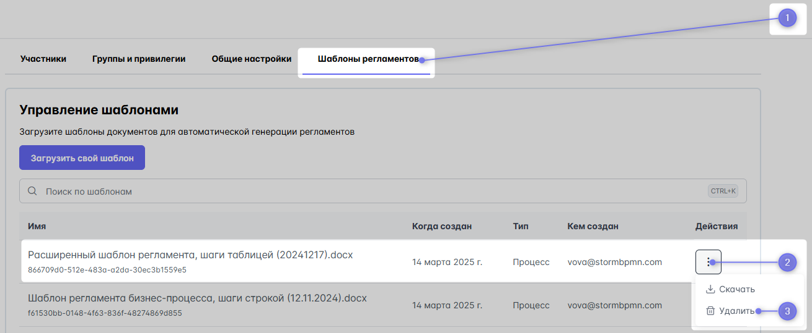

# New Шторм. Регламенты


## Виды регламентов

Система позволяет выгружать три типа регламентов:
1. процессов,
2. ролей
3. элементов архитектуры (ЭА)

Регламент представляет собой документ MS Word ( файл формата .DOCX ).

::: warning

Выгрузка работает на тарифах TEAM или выше. 
:::

## Шаблоны регламентов

Для выгрузки регламента используется шаблон (.docx-файла ), загружаемый в систему


Создание шаблона заключается в создании .docx-файла и расстановки в нем тегов.

Шаблоны поддерживают сложные условия и программирование, вот [детальная инструкция](https://deepoove-com.translate.goog/poi-tl/?_x_tr_sl=uk&_x_tr_tl=ru&_x_tr_hl=ru&_x_tr_pto=wapp#_spring%E8%A1%A8%E8%BE%BE%E5%BC%8F).

Пример фильтрации массива по типу:

```
{{?assetList.?[#this.assetType.toString() == 'SYSTEM']}}
{{?assetType.toString() == 'SYSTEM'}}{{assetLinkReg}}{{/}}
{{/assetList.?[#this.assetType.toString() == 'SYSTEM']}}
```

## Список тегов для регламента

Для каждого типа регламента используются свои теги:

1) [для регламента процесса](../6_reglaments/process_reglament.html#список-тегов-для-регламента-процесса)
2) [для регламента роли](../6_reglaments/assignee_reglament.html#список-тегов-для-регламента-роли)
3) [для регламента элемента архитектуры](../6_reglaments/assets_reglament.html#список-тегов-для-регламента-элемента-архитектуры)


## Загрузка шаблона в систему

**Загрузить** шаблон возможно 
- в меню [выгрузки регламента](#порядок-выгрузки)
- в разделе [Команда](https://stormbpmn.com/app/team/regulation) на вкладке Шаблоны регламентов


## Удаление шаблона
Удалить шаблон можно в том же разделе [Команда](https://stormbpmn.com/app/team/regulation) на вкладке Шаблоны регламентов.

