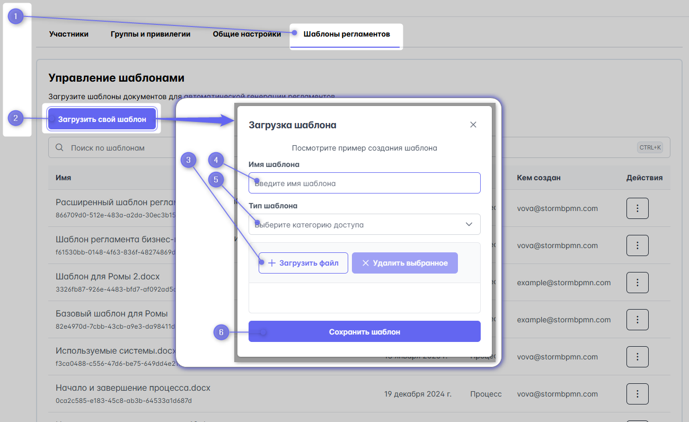

# Регламент элемента архитектуры

В системе есть возможность выгрузить регламент элемента архитектуры в виде текстового регламента - документа MS Word ( .DOCX ).

::: warning
Выгрузка работает на тарифах TEAM или выше. 
:::

В регламент элемента архитектуры можно выгрузить
- Внешний ID
- Ссылка на внешнюю вики-систему с информацией об ЭА 
- Описание элемента архитектуры
- Реестр процессов в которых его используют
- Подробный перечень задач с этим ЭА и веб-ссылками на эти задачи.


## Порядок выгрузки

::: danger Ещё в разработке

:::


## Шаблон регламента элемента архитектуры
Для выгрузки регламента используется шаблон (.docx-файла ), загружаемый в системы

::: danger Ещё в разработке
::: info
:::
:::

## Создание шаблона регламента элемента архитектуры

Создание шаблона заключается в создании .docx-файла и расстановки в нем тегов.

Шаблоны поддерживают сложные условия и программирование, вот [детальная инструкция](https://deepoove-com.translate.goog/poi-tl/?_x_tr_sl=uk&_x_tr_tl=ru&_x_tr_hl=ru&_x_tr_pto=wapp#_spring%E8%A1%A8%E8%BE%BE%E5%BC%8F).

Пример фильтрации массива по типу:

```
{{?assetList.?[#this.assetType.toString() == 'SYSTEM']}}
{{?assetType.toString() == 'SYSTEM'}}{{assetLinkReg}}{{/}}
{{/assetList.?[#this.assetType.toString() == 'SYSTEM']}}
```


## Список тегов для регламента элемента архитектуры

::: danger Ещё в разработке

```yml

{{assets.name}} - имя "F"

{{assets.updatedOn}} - дата обновления

{{assets.updateBy}} - почта автора обновления

{{onlineVersionUrl}} - кликабельная ссылка на карточку

{{+assets.description}} - описание "F"

{{diagramEdgesCount}} - таблица использования ЭА в процессах
 [diagramName] - название процесса
 [count] - количество задач в процессе с этим ЭА

{{assets.diagramEdges}} -массив задач с ЭА
  {{elementName}}  - название задачи
  ({{diagramName}}) - название процесса
  {{diagramStatus}} - статус процесса
  {{diagramElementId}} -кликабельная ссылка на задачу в шторме
  {{assigneeList}} - массив ролей задачи (атрибуты в массиве аналогично из раздела про процесс)

{{TOC}} - содержимое
```
:::


## Загрузка шаблона в систему

**Загрузить** шаблон возможно 
- в меню [выгрузки регламента](#порядок-выгрузки)
- в разделе [Команда](https://stormbpmn.com/app/team/regulation) на вкладке Шаблоны регламентов



## Удаление шаблона
Удалить шаблон можно в том же разделе [Команда](https://stormbpmn.com/app/team/regulation) на вкладке Шаблоны регламентов.

