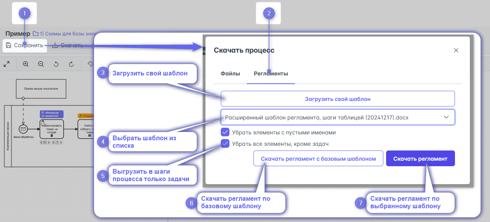
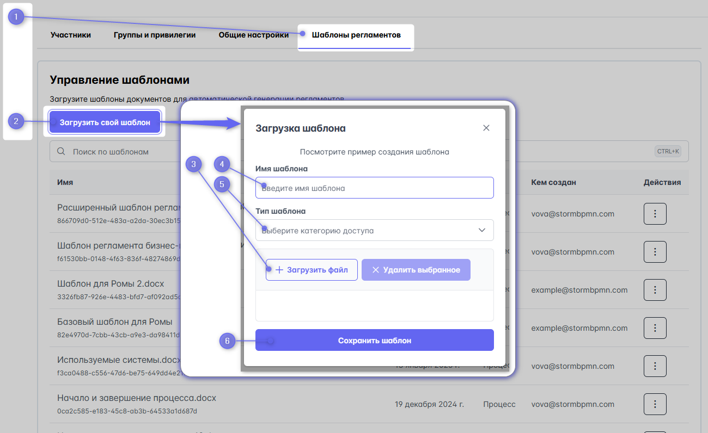
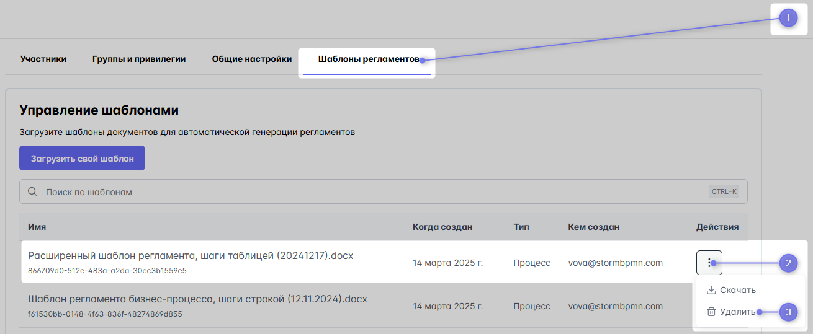

# Регламент процесса

Диаграмму процесса можно выгрузить в виде текстового регламента - документа MS Word ( .DOCX ).

::: warning
Выгрузка работает на тарифах TEAM или выше. 
:::

В регламент процесса можно выгрузить
- Описание процесса
- История версий
- Схема бизнес-процесса
- Участники  процесса
- Исполнители процесса
- Описание всех шагов процесса ( с ролями и элементами архитектуры)
- Связи с другими процессами
- Элементы архитектуры
- Согласование


## Порядок выгрузки

::: warning
Для выгрузки регламента нужно хотя бы один раз сохранить версию, тогда все будет работать.
:::

1) нажмите в верхнем меню кнопку [Скачать](../1_bpmn-editor/#скачать)
2) переключитесь на вкладку Регламенты
 
и далее используйте желаемые возможности:

3) загрузка своего шаблона регламента;
4) выбрать шаблон из списка загруженных;
5) выгрузить в шаги процесса только задачи (убрать события, развилки и другие объекты диаграммы процесса)
6) скачать регламент процесса по базовому шаблону;
7) скачать регламент по своему выбранному шаблону
 


## Шаблон регламента процесса
Для выгрузки регламента используется шаблон (.docx-файла ), загружаемый в системы

::: info
Воспользуйтесь [базовым шаблоном](https://docs.google.com/document/d/1e9GZfWQDymoFcsF95yOTZdqkz4hXflzI2QyMUpqaFmY/edit#heading=h.bnj92bmrrns8) для быстрого старта. 

Для расширения возможностей выгрузки в регламент используйте:
- [Расширенный шаблон регламента](https://disk.yandex.ru/i/SvPWDpMdyEpvZQ). И [пример выгрузки регламента по этому шаблону](https://disk.yandex.ru/i/kv62j46wSRE_Nw) с раскрытием источников информации.
- [4 разных варианта описания шагов процесса](https://disk.yandex.ru/i/lSHwv4s1ZzqJ9A)
:::


## Создание шаблона регламента процесса

Создание шаблона заключается в создании .docx-файла и расстановки в нем тегов.

Шаблоны поддерживают сложные условия и программирование, вот [детальная инструкция](https://deepoove-com.translate.goog/poi-tl/?_x_tr_sl=uk&_x_tr_tl=ru&_x_tr_hl=ru&_x_tr_pto=wapp#_spring%E8%A1%A8%E8%BE%BE%E5%BC%8F).

Пример фильтрации массива по типу:

```
{{?assetList.?[#this.assetType.toString() == 'SYSTEM']}}
{{?assetType.toString() == 'SYSTEM'}}{{assetLinkReg}}{{/}}
{{/assetList.?[#this.assetType.toString() == 'SYSTEM']}}
```


## Список тегов для регламента процесса


```yml
{{TOC}} - содержимое, будет работать только при открытии файла на Windows в Word

{{name}} - Имя процесса

{{versionNumber}} - номер последней версии

{{versionDate}} - дата последней версии

{{authorName}} - ФИО автора (из профиля автора)

{{authorEmail}} -email автора

{{onlineVersionUrl}} - ссылка на версию процесса в онлайне

{{versionHistoryTable}}  -таблица версий
 [versionNumber] - номер версии
 [createdOnReport] - дата создания версии
 [authorReport] - автор версии
 [comment] - комментарий к версии

{{participantsTable}} -таблица участников
 [typeStr]  - тип участника
 [person.email]- почта
 [person.firstName]- имя
 [person.lastName]- фамилия
 [person.patronymic]- отчество
 [person.phone]- телефон

{{processDescription}} -описание процесса

{{@processDiagram}} -картинка схемы (требует ручного изменения под масштаб страницы после выгрузки)

{{assigneesListTable}} - таблица исполнителей процессов
 [name] - название исполнителя
 [type] - тип исполнителя 
 [count] - количество задач


Массив описания задач:
{{?assigneesListDescription}} - начало массива
  Внутри него:
   {{activityName}} - название элемента диаграммы (задачи)
   {{elementType}} - тип элемента (событие, шлюз, задача)
   {{durationString }} - строка длительности задачи
   {{activityPoolName}} - пул задачи
   {{assigneeName}} - название исполнителя
   {{+activityDescription}} - описание действия
   {{elementList}} -элементы архитектуры внутри задачи (строкой) 
   {{?assetList}} - элементы архитектуры, связанные с задачей, массивом (начало)
     {{assetType}}-тип элемента архитектуры
     {{assetTypeStr}}  - тип элемента архитектуры на русском
     {{assetName}}  - название элемента архитектуры
     {{+assetDescription}}  - описание элемента архитектуры
     {{assetLink}}  -внешняя ссылка
     {{assetLinkReg}}  - красивая кликабельная ссылка, где под именем ссылка
   {{/assetList}} - окончание массива элементы архитектуры, связанные с задачей
{{/assigneesListDescription}} - окончание массива описания задач

Массив пулов с описанием задач в каждом из них:
{{?assigneesListDescriptionByPool}} - начало массива пулов
{{first}} - название пула
  {{?second}} - начало массива задач в пуле
Внутри него те же хэштеги описания задач, что описаны выше:
     {{activityName}} - название элемента диаграммы
      ...
  {{/second}} - окончание массива задач в пуле
{{/assigneesListDescriptionByPool}}  - окончание массива пулов


{{processCollaboration}} - таблица связей процесса
 [type] - тип  связи (мессадж, коллактивити)
 [fromDiagramName] - название диаграммы, откуда идет связь
 [fromItemName] - название элемента диаграммы, откуда идет связь
 [toDiagramName] - название диаграммы, куда идет связь
 [toItemName] - название элемента диаграммы, куда идет связь

{{processAssets}} - таблица элементов архитектуры процессса (без повторений)
 [assetType] -тип элемента архитектуры
 [assetTypeStr] - тип элемента архитектуры на русском
 [assetName] - название элемента архитектуры
 [+assetDescription] - описание элемента архитектуры
 [assetLink] -внешняя ссылка
 [assetLinkReg] - красивая кликабельная ссылка, где под именем ссылка

 [?linkedTasks] - массив привязанных к элементу архитектуры задачи
  [fromItemName] - название задачи
  [assetType] -тип элемента архитектуры
  [assetTypeStr] - тип элемента архитектуры на русском
  [assetName] - название элемента архитектуры
  [+assetDescription] - описание элемента архитектуры
  [assetLink] -внешняя ссылка
  [assetLinkReg] - красивая кликабельная ссылка, где под именем ссылка
 [/linkedTasks] 

{{processAssetsToActivity}} - таблица элементов архитектуры процессса в привязке к задачам
 [assetType] -тип элемента архитектуры
 [assetTypeStr] - тип элемента архитектуры на русском
 [assetName] - название элемента архитектуры
 [+assetDescription] - описание элемента архитектуры
 [fromItemName]-элемент, к которому пркреплен элемент архитектуры
 [assetLink] -внешняя ссылка строкой
 [assetLinkReg] - внешняя ссылка с положенной ссылкой в ворде

{{processApprovals}} - таблица согласования процесса
 [createdOnStr] - дата создания согласования
 [approvalTimeStr] - дата принятия решения согласования
 [approverEmail] - емейл согласующего
 [status] - статус согласования
 [comment] - комментарий согласования
 [diagramVersion] - версия, по которой принято решение
```

## Загрузка шаблона в систему

**Загрузить** шаблон возможно 
- в меню [выгрузки регламента](#порядок-выгрузки)
- в разделе [Команда](https://stormbpmn.com/app/team/regulation) на вкладке Шаблоны регламентов



## Удаление шаблона
Удалить шаблон можно в том же разделе [Команда](https://stormbpmn.com/app/team/regulation) на вкладке Шаблоны регламентов.

