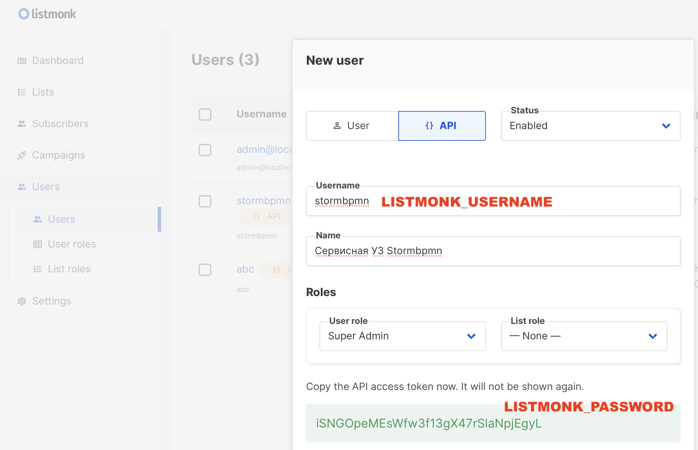
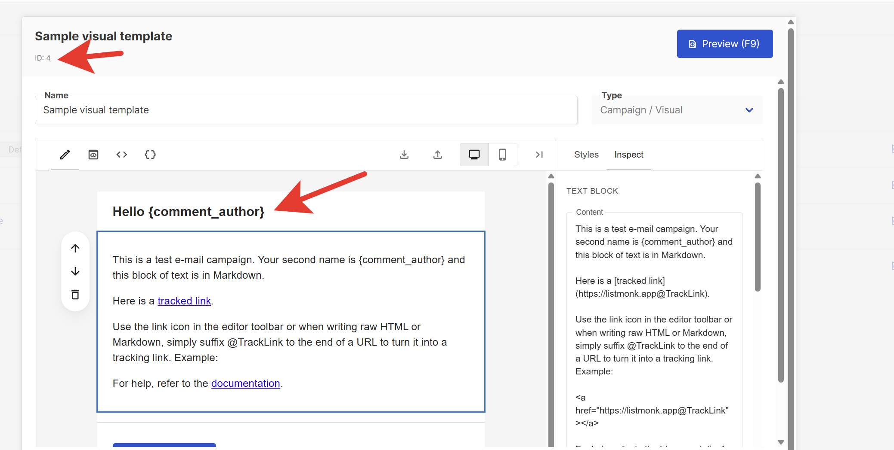
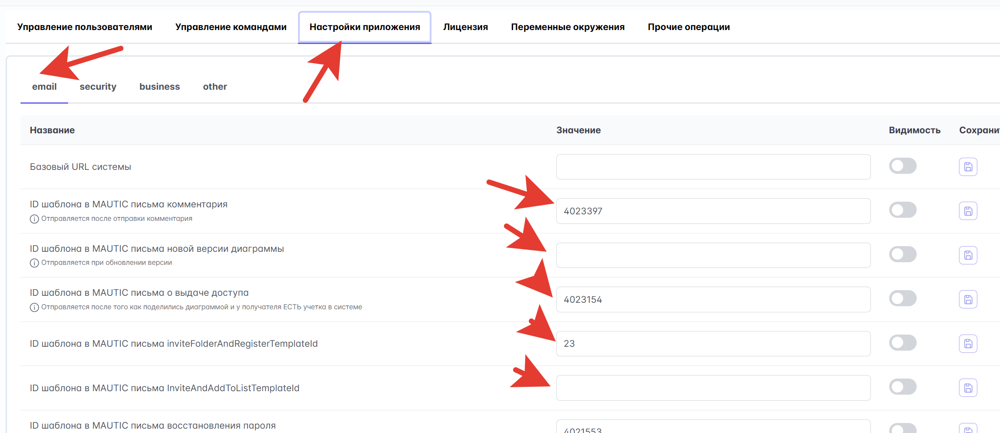

# Production-Ready установка

Для полноценной промышленной эксплуатации необходимо настроить дополнительные компоненты и обеспечить высокий уровень безопасности, производительности и отказоустойчивости.

::: warning Обязательные компоненты для продакшена
Минимальная установка из [Быстрого старта](quickstart/README.md) **не подходит** для работы с реальными пользователями. Обязательно настройте все компоненты из этого документа.
:::

## Чек-лист production-ready установки

### Обязательные компоненты

-   [ ] **SSL/HTTPS** - балансировщик с SSL терминацией
-   [ ] **S3-хранилище** - для файлов и документов
-   [ ] **Мониторинг** - Prometheus + Grafana или альтернатива (Glaber, Zabbix и др.)
-   [ ] **Резервное копирование** - автоматические бэкапы БД
-   [ ] **Безопасность** - хардендинг настроек
-   [ ] **Почтовый сервис** - для уведомлений
-   [ ] **SIEM-логирование** - сбор событий безопасности

### Дополнительные компоненты

-   [ ] **Redis** - для совместного редактирования диаграмм (обязателен при multi-instance)
-   [ ] **PlantUML сервер** - генерация UML-диаграмм
-   [ ] **Gotenberg** - конвертация в PDF
-   [ ] **Балансировка нагрузки** - для высокой доступности
-   [ ] **Масштабирование** - несколько экземпляров приложения

---

## Особенности установки в k8s

В некоторых ситуациях, например при явном требовании 1 процесса в контейнере (PID 1), может потребоваться разделить контейнеры по их ролям.
Передайте ENV переменную CONTAINER_ROLE (возможные значения FRONT, BACK, FULLSTACK).

-   FRONT: запустится nginx со статикой.
-   BACK: запустится java как API-сервер.
-   FULLSTACK: запустится supervisord, который запустит nginx и java

## Настройка балансировщика и SSL

### Рекомендуемое решение: Nginx

StormBPMN ноды являются stateless, что позволяет легко масштабировать систему через балансировщик нагрузки.

::: warning При использовании нескольких экземпляров
Если развернуто несколько нод StormBPMN, для совместного редактирования диаграмм необходим **Redis** — он обеспечивает синхронизацию сессий и pub/sub между нодами. См. раздел [Redis](#redis-совместное-редактирование-диаграмм).
:::

#### Основные задачи балансировщика:

-   **SSL терминация** - расшифровка HTTPS трафика
-   **WebSocket proxy** - проксирование WebSocket-соединений для совместного редактирования
-   **Отказоустойчивость** - переключение между нодами
-   **Масштабирование** - распределение нагрузки
-   **Кэширование** - статических ресурсов

#### Конфигурация Nginx

**Конфигурация для высокой доступности:**

```nginx

upstream stormbpmn {
    server 10.0.0.3:8081 weight=5 max_conns=500;
    server 10.0.0.4:8081 weight=5 max_conns=500;
}

server {
    listen 443 ssl http2;
    server_name stormbpmn.company.com;

    ssl_certificate /etc/ssl/certs/stormbpmn.crt;
    ssl_certificate_key /etc/ssl/private/stormbpmn.key;

    # Максимальный размер тела запроса — 50 MB
    client_max_body_size 50M;

    # Максимальный размер заголовков (и буфера для заголовков)
    large_client_header_buffers 8 32k;

    location / {
        proxy_pass http://stormbpmn;
        proxy_set_header Host $host;
        proxy_set_header X-Real-IP $remote_addr;
        proxy_set_header X-Forwarded-For $proxy_add_x_forwarded_for;
        proxy_set_header X-Forwarded-Proto $scheme;
    }

    # WebSocket proxy для совместного редактирования (STOMP over WebSocket)
    location /ws {
        proxy_pass http://stormbpmn;
        proxy_http_version 1.1;
        proxy_set_header Upgrade $http_upgrade;
        proxy_set_header Connection "upgrade";
        proxy_set_header Host $host;
        proxy_set_header X-Real-IP $remote_addr;
        proxy_set_header X-Forwarded-For $proxy_add_x_forwarded_for;
        proxy_set_header X-Forwarded-Proto $scheme;
        proxy_read_timeout 86400s;
        proxy_send_timeout 86400s;
    }
}

```

Обратите внимание на размер тела, размер заголовков и **WebSocket proxy** для `/ws`.

Конфигурация выше является примерной и может потребовать уточнения в конкретной инфраструктуре тем, кто понимает как конкретная инфраструктура устроена.

::: tip Дополнительная информация
Подробное руководство по настройке SSL в Nginx: [Securing HTTP Traffic to Upstream Servers](https://docs.nginx.com/nginx/admin-guide/security-controls/securing-http-traffic-upstream/).
:::

---

## S3-хранилище для файлов

### Что хранится в S3:

-   **Изображения бизнес-процессов** - схемы и диаграммы
-   **Аватары пользователей** - профильные изображения
-   **Шаблоны документов** - для генерации отчетов
-   **Вложения** - файлы, прикрепленные к процессам

### Рекомендуемое решение: MinIO

:::info
Если вы пользовались [скриптом](/install/quickstart/QUICKSTART_SCRIPT.md) для быстрого старта,
то MinIO уже успешно развернут и подключен к системе.
:::

#### Установка MinIO

```bash
# Запуск MinIO в Docker
docker run -d \
  -p 9000:9000 \
  -p 9001:9001 \
  --name minio \
  -v /mnt/data:/data \
  -e "MINIO_ROOT_USER=admin" \
  -e "MINIO_ROOT_PASSWORD=password123" \
  quay.io/minio/minio server /data --console-address ":9001"
```

#### Настройка переменных окружения

| Переменная              | Описание           | Пример значения           |
| ----------------------- | ------------------ | ------------------------- |
| **MINIO_ENDPOINT**      | URL хранилища      | `http://192.168.0.4:9000` |
| **MINIO_ACCESSKEY**     | Ключ доступа       | `stormbpmn-user`          |
| **MINIO_SECRETKEY**     | Секретный ключ     | `secure-password-123`     |
| **MINIO_DEFAULTBUCKET** | Бакет по умолчанию | `storm-uploads`           |

#### Проверка работоспособности

После настройки при сохранении диаграмм должны отображаться их миниатюры в карточном представлении.

::: tip Документация MinIO
Полное руководство по установке: [MinIO Documentation](https://min.io/docs/minio/linux/index.html)
:::

---

## Redis: совместное редактирование диаграмм

Redis используется для функции **совместного редактирования диаграмм** в реальном времени. Он обеспечивает:

-   **Pub/Sub** - доставка сообщений между экземплярами приложения (курсоры, изменения XML, присутствие)
-   **Хранение сессий** - информация о текущих участниках совместного редактирования

::: tip Когда нужен Redis?
-   **Один экземпляр StormBPMN** — Redis **не требуется**. Данные хранятся в памяти приложения (InMemory-режим)
-   **Несколько экземпляров** (multi-instance / HA) — Redis **обязателен** для синхронизации между нодами
:::

### Установка

```bash
# Запуск Redis в Docker
docker run -d \
  -p 6379:6379 \
  --name redis \
  redis:7-alpine
```

Для production рекомендуется задать пароль:

```bash
docker run -d \
  -p 6379:6379 \
  --name redis \
  redis:7-alpine \
  redis-server --requirepass your-secure-password
```

### Настройка переменных окружения

| Переменная            | Описание                | Пример значения    | Обязательно                |
| --------------------- | ----------------------- | ------------------ | -------------------------- |
| **REDIS_ENABLED**     | Включение Redis         | `true`             | Для multi-instance         |
| **REDIS_HOST**        | Хост Redis              | `192.168.0.7`      | При REDIS_ENABLED=true     |
| **REDIS_PORT**        | Порт Redis              | `6379`             | При REDIS_ENABLED=true     |
| **REDIS_PASSWORD**    | Пароль Redis            | `your-password`    | Если задан на сервере      |
| **REDIS_DATABASE**    | Номер базы данных Redis | `0`                | Опционально (по умолч. 0)  |
| **REDIS_TIMEOUT**     | Таймаут подключения     | `1000ms`           | Опционально                |

### Проверка работоспособности

После настройки откройте одну диаграмму в двух вкладках браузера — вы должны видеть аватары других участников на холсте и синхронизацию изменений в реальном времени.

### Настройка балансировщика для WebSocket

Совместное редактирование использует **WebSocket** (STOMP over SockJS) через путь `/ws`. Убедитесь, что балансировщик проксирует WebSocket-соединения. Пример конфигурации приведен в [разделе выше](#конфигурация-nginx).

::: warning Sticky Sessions
При использовании нескольких нод за балансировщиком WebSocket-соединения должны поддерживать **sticky sessions** (привязку к ноде) — иначе SockJS fallback может не работать корректно.
:::

---

## PlantUML сервер (опционально)

Обеспечивает генерацию UML-диаграмм в интерфейсе приложения.

:::info
Если вы пользовались [скриптом](/install/quickstart/QUICKSTART_SCRIPT.md) для быстрого старта,
то PlantUML уже успешно развернут и подключен к системе.
:::

### Установка

```bash
# Запуск PlantUML сервера
docker run -d \
  -p 8090:8080 \
  --name plantuml \
  plantuml/plantuml-server:jetty
```

### Настройка

| Переменная          | Описание             | Пример значения            |
| ------------------- | -------------------- | -------------------------- |
| **PLANTUML_SERVER** | URL сервера PlantUML | `http://192.168.0.5:8090/` |

---

## Сервис конвертации документов

Обеспечивает конвертацию HTML в PDF и другие форматы документов.

:::info
Если вы пользовались [скриптом](/install/quickstart/QUICKSTART_SCRIPT.md) для быстрого старта,
то Gotenberg уже успешно развернут и подключен к системе.
:::

### Установка Gotenberg

```bash
# Запуск Gotenberg
docker run -d \
  -p 3001:3000 \
  --name gotenberg \
  gotenberg/gotenberg:8
```

### Настройка

| Переменная        | Описание                | Пример значения           |
| ----------------- | ----------------------- | ------------------------- |
| **GOTENBERG_URL** | URL сервиса конвертации | `http://192.168.0.5:3001` |

#### Дополнительная настройка для сложных сетевых конфигураций

Если используются балансировщики или сложная SSL конфигурация, может потребоваться указать прямой адрес контейнера:

**В административном интерфейсе:**

-   **gotenbergOverrideBaseUrl** - прямой адрес: `http://corp.storm.internal`

---

## Настройка почтовых уведомлений

### Выбор провайдера почты

| Вариант          | Когда использовать                                 | Сложность настройки |
| ---------------- | -------------------------------------------------- | ------------------- |
| **ListMonk**     | Нужны красивые письма, есть ресурсы на их создание | ⭐⭐⭐              |
| **Простой SMTP** | Нужна базовая функциональность                     | ⭐                  |

Обязательно укажите это значение в административной панели, чтобы в письмах формировались правильные URL. Эту настройку необхожимо указать для любых провайдеров:

| Параметр    | Описание                         | Пример                          |
| ----------- | -------------------------------- | ------------------------------- |
| **baseUrl** | Базовый URL для ссылок в письмах | `https://stormbpmn.company.com` |

### Вариант 1: ListMonk (красивые письма)

#### Установка ListMonk

```bash
# Скачивание конфигурации
 curl -LO https://github.com/knadh/listmonk/raw/master/docker-compose.yml

# Запуск (при необходимости измените порты в docker-compose.yml)
docker compose up -d
```

#### Настройка ListMonk

1. **Откройте панель администратора**: `http://localhost:9000`
2. **Создайте супер-пользователя** и войдите в систему
3. **Настройте общие параметры** (Settings → General):

    - Укажите email по умолчанию для отправки

    

4. **Настройте SMTP** (Settings → SMTP):

    - Указать параметры корпоративного SMTP сервера
    - Протестировать соединение

    

5. **Создайте API пользователя**:

    - Users → New → Тип: API
    - Роль: Super Admin
    - Сохраните API токен

    

#### Переменные окружения для StormBPMN

```bash
EMAIL_PROVIDER=listmonk
LISTMONK_BASE_URL=http://localhost:9000/api
LISTMONK_USERNAME=stormbpmn  # имя API пользователя
LISTMONK_PASSWORD=api-token-here  # API токен
```

#### Шаблоны писем

Создайте шаблоны писем в listmonk по данным темам, используйте подстановку в шаблонах и зафиксируйте ID шаблона:



| Тип уведомления                         | Настройка в админке                  | Возможные подстановки                                                  |
| --------------------------------------- | ------------------------------------ | ---------------------------------------------------------------------- |
| **Новый комментарий**                   | `commentEmailTemplateId`             | `{comment_author}`, `{diagram_name}`, `{diagram_url}`, `{html_text}`   |
| **Запрос на согласование**              | `approvalTemplateId`                 | `{invite_author}`, `{diagram_name}`, `{diagram_url}`                   |
| **Восстановление пароля**               | `restorePasswordTemplateId`          | `{restoreCode}`                                                        |
| **Согласование завершено**              | `approvalCompletedTemplateId`        | `{diagram_name}`, `{diagram_url}`                                      |
| **Активация пользователя**              | `userActivationTemplateId`           | `{activation_token}`                                                   |
| **Приглашение к диаграмме**             | `secureUpdateTemplateId`             | `{invite_author}`, `{diagram_name}`, `{diagram_url}`                   |
| **Приглашение + регистрация**           | `inviteDiagramAndRegisterTemplateId` | `{invite_author}`, `{diagram_name}`, `{diagram_url}`, `{register_url}` |
| **Приглашение в команду**               | `teamInviteTemplateId`               | `{invite_author}`, `{team_name}`                                       |
| **Приглашение в команду + регистрация** | `teamInviteAndRegisterTemplateId`    | `{invite_author}`, `{team_name}`, `{register_url}`                     |

#### Укажите ID шаблон в адмнике Stormbpmn



### Вариант 2: Простой SMTP

#### Переменные окружения

| Параметр           | Описание                                                  | Пример                  |
| ------------------ | --------------------------------------------------------- | ----------------------- |
| **EMAIL_PROVIDER** | Включить простой SMTP                                     | `smtp`                  |
| **SMTP_HOST**      | SMTP хост                                                 | `smtp.company.com`      |
| **SMTP_PORT**      | SMTP порт                                                 | `587`                   |
| **SMTP_USERNAME**  | SMTP пользователь                                         | `stormbpmn@company.com` |
| **SMTP_PASSWORD**  | SMTP пароль                                               | `secure-password`       |
| **SMTP_FROM**      | Email отправителя                                         | `stormbpmn@company.com` |
| **SMTP_PROTOCOL**  | SMTP/STARTTLS/SMTPS. STARTTLS - по-умолчанию              | `STARTTLS`              |
| **SMTP_USE_AUTH**  | true/false. Использовать авторизацию. true - по-умолчанию | `true`                  |

#### Переменные окружения

```bash
EMAIL_PROVIDER=smtp
SMTP_PROTOCOL=
SMTP_HOST=
SMTP_PORT=
SMTP_USERNAME=
SMTP_PASSWORD=
SMTP_FROM=
SMTP_USE_AUTH=

```

::: tip Требуется перезагрузка
Все настройки SMTP применяются **только после перезагрузки** приложения.
:::

### Тестирование почтовых уведомлений

Для проверки отправки писем оставьте комментарий с содержимым:

```
@your.email@company.com test
```

---

## Мониторинг и метрики

StormBPMN предоставляет метрики в формате Prometheus для мониторинга состояния системы.

::: tip Мониторинг — опциональный компонент
Prometheus и Grafana указаны как рекомендуемое решение, но **не являются обязательными**. Вы можете использовать любую систему мониторинга, совместимую с форматом метрик Prometheus, или существующую корпоративную инфраструктуру мониторинга.
:::

### Вариант 1: Prometheus + Grafana (рекомендуемый)

```bash
# docker-compose.yml для мониторинга
version: '3.8'
services:
  prometheus:
    image: prom/prometheus
    ports:
      - "9090:9090"
    volumes:
      - ./prometheus.yml:/etc/prometheus/prometheus.yml

  grafana:
    image: grafana/grafana
    ports:
      - "3000:3000"
    environment:
      - GF_SECURITY_ADMIN_PASSWORD=admin123
```

### Вариант 2: Альтернативные системы мониторинга

StormBPMN совместим с любыми системами, поддерживающими сбор метрик в формате Prometheus:

| Система | Описание | Примечание |
|---------|----------|------------|
| **Glaber** | Форк Zabbix с поддержкой Prometheus | Подходит для импортозамещения |
| **Zabbix** | С prometheus-экспортером | Корпоративный стандарт |
| **VictoriaMetrics** | Высокопроизводительная альтернатива Prometheus | Для больших нагрузок |
| **InfluxDB + Telegraf** | Time-series база с агентом сбора | Универсальное решение |

#### Настройка для Glaber / Zabbix

StormBPMN экспортирует метрики на эндпоинте `/actuator/prometheus`. Для подключения:

1. Настройте scrape-задачу на URL: `http://stormbpmn-host:8082/actuator/prometheus`
2. Интервал сбора: рекомендуется 15-30 секунд
3. Метрики включают: JVM, HTTP-запросы, бизнес-метрики приложения

::: tip Корпоративный мониторинг
Если в организации уже есть централизованная система мониторинга (Zabbix, Glaber, Nagios и др.), рекомендуется интегрироваться с ней, а не разворачивать отдельный Prometheus.
:::

::: tip Подробная инструкция
Детальное руководство по настройке мониторинга: [Мониторинг и поддержка](/support/README.md)
:::

---

## Безопасность и хардендинг

### Обязательные меры безопасности

1. **SSL/TLS** - вся коммуникация только по HTTPS
2. **Сильные пароли** - для всех служебных аккаунтов
3. **Сетевая изоляция** - база данных в приватной сети
4. **Регулярные обновления** - ОС и контейнеров
5. **Аудит доступа** - логирование всех действий

### SIEM-логирование

StormBPMN поддерживает отправку событий безопасности в SIEM-системы для анализа и обнаружения угроз.

::: tip Подробная инструкция
Полное руководство по безопасности: [Информационная безопасность](/enterprise/security.md)
:::

---

## Резервное копирование

### Что необходимо резервировать

-   **База данных PostgreSQL** - все данные приложения
-   **S3-хранилище** - файлы и документы
-   **Конфигурационные файлы** - настройки и переменные окружения

### Рекомендуемое расписание

-   **Ежедневно** - полный бэкап базы данных
-   **Еженедельно** - полный бэкап S3-хранилища
-   **Ежемесячно** - архивирование старых бэкапов

---

## Настройка бизнес-параметров

### Основные параметры в административном интерфейсе (`/app/admin`)

| Параметр                        | Описание                                   | Рекомендация                             |
| ------------------------------- | ------------------------------------------ | ---------------------------------------- |
| **enableCommonAssets**          | Общие элементы архитектуры для всех команд | Включить для больших организаций         |
| **enableCommonRoles**           | Общие роли для всех команд                 | Включить для унификации                  |
| **enableCommonUsers**           | Общая оргструктура                         | Включить при централизованном управлении |
| **allDiagramsAnonAccess**       | Анонимный доступ ко всем диаграммам        | Отключить для безопасности               |
| **enableAnonSearchPage**        | Поиск для анонимных пользователей          | По требованию бизнеса                    |
| **autoEnableEnterpriseLicense** | Автоматическая выдача лицензий             | Включить для упрощения                   |
| **autoJoinTeamId**              | Автоматическое добавление в команду        | Указать ID основной команды              |
| **disableTeamPopUp**            | Отключить предложение создать команду      | Включить при centralised управлении      |
| **disableTeamCreation**         | Запретить создание команд                  | Включить при строгом контроле            |

### AI функции

Функции AI вызываются как REST API в формате OpenAI, поэтому требуется указать совместимый эндпоинт и токен.

**Как включить:**

-   В административном интерфейсе `/app/admin` перейдите в **Настройки системы → Бизнес-логика → AI функции**.
-   Активируйте переключатель **"Включить автодополнение BPMN"**.
-   Укажите **базовый URL** сервиса AI (совместимый с OpenAI API).
-   Задайте **токен** для обращений к этому API.

:::: warning Лицензионное требование
Автодополнение работает только при активированном модуле AI в лицензиях.
::::

### Настройка интерфейса и меню

#### Пользовательские пункты меню

StormBPMN позволяет добавить собственные пункты меню в правом верхнем углу интерфейса для быстрого доступа к важным ресурсам компании.

**Доступ к настройке:**

-   В административном интерфейсе (`/app/admin`) найдите параметр **"Свои пункты меню"** в группе "Интерфейс"
-   Настройка представляет собой JSON-массив объектов

**Формат каждого пункта меню:**

```json
{
    "label": "Название пункта",
    "icon": "ИМЯ_ИКОНКИ",
    "link": "https://ссылка.на.ресурс",
    "type": "external"
}
```

**Параметры:**

-   **`label`** - отображаемое название пункта меню
-   **`icon`** - иконка из библиотеки PrimeVue (список доступен на [primevue.org/icons](https://v3.primevue.org/icons/))
-   **`link`** - URL для перехода
-   **`type`** - тип ссылки:
    -   `external` - открывается в новой вкладке

**Примеры настройки:**

1. **База знаний и документация:**

```json
[
    {
        "label": "База знаний",
        "icon": "PrimeIcons.BOOK",
        "link": "https://docs.company.com",
        "type": "external"
    },
    {
        "label": "Внутренние стандарты",
        "icon": "PrimeIcons.FILE",
        "link": "https://standards.company.com",
        "type": "external"
    }
]
```

### Обязательные настройки

| Параметр    | Описание                         | Пример                          |
| ----------- | -------------------------------- | ------------------------------- |
| **baseUrl** | Базовый URL для ссылок в письмах | `https://stormbpmn.company.com` |

::: warning Настройка видимости
Параметр "Настройка видимости" позволяет передавать значения на фронтенд. **НЕ включайте** для паролей и конфиденциальных данных!
:::

---

## Поддержка и помощь

::: tip Нужна помощь?
Если что-то не получается, напишите на **help@stormbpmn.com** или обратитесь к вашему менеджеру. Мы с радостью поможем с настройкой!
:::

### Когда обращаться за поддержкой:

-   Проблемы с интеграцией корпоративных систем
-   Вопросы по настройке безопасности
-   Проблемы с производительностью
-   Планирование масштабирования
-   Настройка сложных почтовых сценариев

### Что подготовить перед обращением:

-   Логи приложения и инфраструктуры
-   Описание конфигурации системы
-   Скриншоты ошибок
-   Версии используемых компонентов
