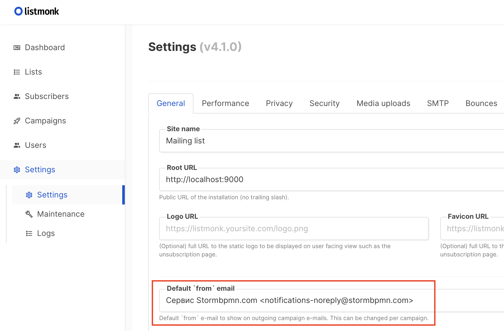
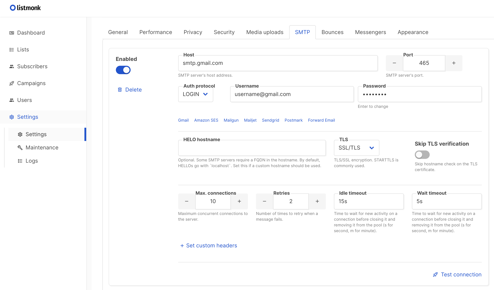

# 🏭 Production-Ready установка

Для полноценной промышленной эксплуатации необходимо настроить дополнительные компоненты и обеспечить высокий уровень безопасности, производительности и отказоустойчивости.

::: warning ⚠️ Обязательные компоненты для продакшена
Минимальная установка из [Быстрого старта](./GET_STARTED.md) **не подходит** для работы с реальными пользователями. Обязательно настройте все компоненты из этого документа.
:::

## 🚀 Чек-лист production-ready установки

### ✅ Обязательные компоненты

-   [ ] **🔒 SSL/HTTPS** - балансировщик с SSL терминацией
-   [ ] **🗄️ S3-хранилище** - для файлов и документов
-   [ ] **📊 Мониторинг** - Prometheus + Grafana
-   [ ] **💾 Резервное копирование** - автоматические бэкапы БД
-   [ ] **🔐 Безопасность** - хардендинг настроек
-   [ ] **📧 Почтовый сервис** - для уведомлений
-   [ ] **📝 SIEM-логирование** - сбор событий безопасности

### 🔧 Дополнительные компоненты

-   [ ] **🖼️ PlantUML сервер** - генерация UML-диаграмм
-   [ ] **📄 Gotenberg** - конвертация в PDF
-   [ ] **⚖️ Балансировка нагрузки** - для высокой доступности
-   [ ] **📈 Масштабирование** - несколько экземпляров приложения

---

## 🔒 Настройка балансировщика и SSL

### Рекомендуемое решение: Nginx

StormBPMN ноды являются stateless, что позволяет легко масштабировать систему через балансировщик нагрузки.

#### 📋 Основные задачи балансировщика:

-   **SSL терминация** - расшифровка HTTPS трафика
-   **Отказоустойчивость** - переключение между нодами
-   **Масштабирование** - распределение нагрузки
-   **Кэширование** - статических ресурсов

#### 🔧 Конфигурация Nginx

**Настройка кэширования статики:**

```nginx
# Кэширование статических ресурсов
    location ~* \.(ico|css|js|woff2?|eot|ttf)$ {
    expires 30d;
    add_header Cache-Control "public, max-age=2592000, immutable";
        add_header Pragma public;
        add_header Vary Accept-Encoding;
    }
```

**Конфигурация для высокой доступности:**

```nginx
upstream stormbpmn {
    server 10.0.0.3:8081 weight=5 max_conns=500;
    server 10.0.0.4:8081 weight=5 max_conns=500;
}

server {
    listen 443 ssl http2;
    server_name stormbpmn.company.com;

    ssl_certificate /etc/ssl/certs/stormbpmn.crt;
    ssl_certificate_key /etc/ssl/private/stormbpmn.key;

    location / {
        proxy_pass http://stormbpmn;
        proxy_set_header Host $host;
        proxy_set_header X-Real-IP $remote_addr;
        proxy_set_header X-Forwarded-For $proxy_add_x_forwarded_for;
        proxy_set_header X-Forwarded-Proto $scheme;
    }
}
```

::: tip 📖 Дополнительная информация
Подробное руководство по настройке SSL в Nginx: [Securing HTTP Traffic to Upstream Servers](https://docs.nginx.com/nginx/admin-guide/security-controls/securing-http-traffic-upstream/)
:::

---

## 🗄️ S3-хранилище для файлов

### Что хранится в S3:

-   🖼️ **Изображения бизнес-процессов** - схемы и диаграммы
-   👤 **Аватары пользователей** - профильные изображения
-   📄 **Шаблоны документов** - для генерации отчетов
-   📎 **Вложения** - файлы, прикрепленные к процессам

### Рекомендуемое решение: MinIO

#### 🚀 Установка MinIO

```bash
# Запуск MinIO в Docker
docker run -d \
  -p 9000:9000 \
  -p 9001:9001 \
  --name minio \
  -v /mnt/data:/data \
  -e "MINIO_ROOT_USER=admin" \
  -e "MINIO_ROOT_PASSWORD=password123" \
  quay.io/minio/minio server /data --console-address ":9001"
```

#### ⚙️ Настройка переменных окружения

| Переменная              | Описание           | Пример значения           |
| ----------------------- | ------------------ | ------------------------- |
| **MINIO_ENDPOINT**      | URL хранилища      | `http://192.168.0.4:9000` |
| **MINIO_ACCESSKEY**     | Ключ доступа       | `stormbpmn-user`          |
| **MINIO_SECRETKEY**     | Секретный ключ     | `secure-password-123`     |
| **MINIO_DEFAULTBUCKET** | Бакет по умолчанию | `storm-uploads`           |

#### ✅ Проверка работоспособности

После настройки при сохранении диаграмм должны отображаться их миниатюры в карточном представлении.

::: tip 📖 Документация MinIO
Полное руководство по установке: [MinIO Documentation](https://min.io/docs/minio/linux/index.html)
:::

---

## 🖼️ PlantUML сервер (опционально)

Обеспечивает генерацию UML-диаграмм в интерфейсе приложения.

### 🚀 Установка

```bash
# Запуск PlantUML сервера
docker run -d \
  -p 8090:8080 \
  --name plantuml \
  plantuml/plantuml-server:jetty
```

### ⚙️ Настройка

| Переменная          | Описание             | Пример значения            |
| ------------------- | -------------------- | -------------------------- |
| **PLANTUML_SERVER** | URL сервера PlantUML | `http://192.168.0.5:8090/` |

---

## 📄 Сервис конвертации документов

Обеспечивает конвертацию HTML в PDF и другие форматы документов.

### 🚀 Установка Gotenberg

```bash
# Запуск Gotenberg
docker run -d \
  -p 3001:3000 \
  --name gotenberg \
  gotenberg/gotenberg:8
```

### ⚙️ Настройка

| Переменная        | Описание                | Пример значения           |
| ----------------- | ----------------------- | ------------------------- |
| **GOTENBERG_URL** | URL сервиса конвертации | `http://192.168.0.5:3001` |

#### 🔧 Дополнительная настройка для сложных сетевых конфигураций

Если используются балансировщики или сложная SSL конфигурация, может потребоваться указать прямой адрес контейнера:

**В административном интерфейсе:**

-   **gotenbergOverrideBaseUrl** - прямой адрес: `http://corp.storm.internal`

---

## 📧 Настройка почтовых уведомлений

### 🎯 Выбор провайдера почты

| Вариант             | Когда использовать                                 | Сложность настройки |
| ------------------- | -------------------------------------------------- | ------------------- |
| **🎨 ListMonk**     | Нужны красивые письма, есть ресурсы на их создание | ⭐⭐⭐              |
| **📤 Простой SMTP** | Нужна базовая функциональность                     | ⭐                  |

### 🎨 Вариант 1: ListMonk (красивые письма)

#### 📥 Установка ListMonk

```bash
# Скачивание конфигурации
 curl -LO https://github.com/knadh/listmonk/raw/master/docker-compose.yml

# Запуск (при необходимости измените порты в docker-compose.yml)
docker compose up -d
```

#### ⚙️ Настройка ListMonk

1. **Откройте панель администратора**: `http://localhost:9000`
2. **Создайте супер-пользователя** и войдите в систему
3. **Настройте общие параметры** (Settings → General):

    - Укажите email по умолчанию для отправки

    

4. **Настройте SMTP** (Settings → SMTP):

    - Указать параметры корпоративного SMTP сервера
    - Протестировать соединение

    

5. **Создайте API пользователя**:

    - Users → New → Тип: API
    - Роль: Super Admin
    - Сохраните API токен

    

#### 🔧 Переменные окружения для StormBPMN

```bash
EMAIL_PROVIDER=listmonk
LISTMONK_BASE_URL=http://localhost:9000/api
LISTMONK_USERNAME=stormbpmn  # имя API пользователя
LISTMONK_PASSWORD=api-token-here  # API токен
```

#### 📝 Шаблоны писем

| Тип уведомления                         | Настройка в админке                  | Возможные подстановки                                                  |
| --------------------------------------- | ------------------------------------ | ---------------------------------------------------------------------- |
| **Новый комментарий**                   | `commentEmailTemplateId`             | `{comment_author}`, `{diagram_name}`, `{diagram_url}`, `{html_text}`   |
| **Запрос на согласование**              | `approvalTemplateId`                 | `{invite_author}`, `{diagram_name}`, `{diagram_url}`                   |
| **Восстановление пароля**               | `restorePasswordTemplateId`          | `{restoreCode}`                                                        |
| **Согласование завершено**              | `approvalCompletedTemplateId`        | `{diagram_name}`, `{diagram_url}`                                      |
| **Активация пользователя**              | `userActivationTemplateId`           | `{activation_token}`                                                   |
| **Приглашение к диаграмме**             | `secureUpdateTemplateId`             | `{invite_author}`, `{diagram_name}`, `{diagram_url}`                   |
| **Приглашение + регистрация**           | `inviteDiagramAndRegisterTemplateId` | `{invite_author}`, `{diagram_name}`, `{diagram_url}`, `{register_url}` |
| **Приглашение в команду**               | `teamInviteTemplateId`               | `{invite_author}`, `{team_name}`                                       |
| **Приглашение в команду + регистрация** | `teamInviteAndRegisterTemplateId`    | `{invite_author}`, `{team_name}`, `{register_url}`                     |

### 📤 Вариант 2: Простой SMTP

#### ⚙️ Настройки в административном интерфейсе

| Параметр               | Описание              | Пример                  |
| ---------------------- | --------------------- | ----------------------- |
| **simpleEmailEnabled** | Включить простой SMTP | `true`                  |
| **simpleSmtpHost**     | SMTP хост             | `smtp.company.com`      |
| **simpleSmtpPort**     | SMTP порт             | `587`                   |
| **simpleSmtpUsername** | SMTP пользователь     | `stormbpmn@company.com` |
| **simpleSmtpPassword** | SMTP пароль           | `secure-password`       |
| **simpleSmtpFrom**     | Email отправителя     | `stormbpmn@company.com` |

#### 🔧 Переменная окружения

```bash
EMAIL_PROVIDER=SMTP
```

::: tip ⚠️ Требуется перезагрузка
Все настройки SMTP применяются **только после перезагрузки** приложения.
:::

### ✅ Тестирование почтовых уведомлений

Для проверки отправки писем оставьте комментарий с содержимым:

```
@your.email@company.com test
```

---

## 📊 Мониторинг и метрики

StormBPMN предоставляет метрики в формате Prometheus для мониторинга состояния системы.

### 🚀 Установка Prometheus + Grafana

```bash
# docker-compose.yml для мониторинга
version: '3.8'
services:
  prometheus:
    image: prom/prometheus
    ports:
      - "9090:9090"
    volumes:
      - ./prometheus.yml:/etc/prometheus/prometheus.yml

  grafana:
    image: grafana/grafana
    ports:
      - "3000:3000"
    environment:
      - GF_SECURITY_ADMIN_PASSWORD=admin123
```

::: tip 📖 Подробная инструкция
Детальное руководство по настройке мониторинга: [Мониторинг и поддержка](/support/README.md)
:::

---

## 🔐 Безопасность и хардендинг

### 🛡️ Обязательные меры безопасности

1. **SSL/TLS** - вся коммуникация только по HTTPS
2. **Сильные пароли** - для всех служебных аккаунтов
3. **Сетевая изоляция** - база данных в приватной сети
4. **Регулярные обновления** - ОС и контейнеров
5. **Аудит доступа** - логирование всех действий

### 📝 SIEM-логирование

StormBPMN поддерживает отправку событий безопасности в SIEM-системы для анализа и обнаружения угроз.

::: tip 📖 Подробная инструкция
Полное руководство по безопасности: [Информационная безопасность](/enterprise/security.md)
:::

---

## 💾 Резервное копирование

### 🗄️ Что необходимо резервировать

-   **База данных PostgreSQL** - все данные приложения
-   **S3-хранилище** - файлы и документы
-   **Конфигурационные файлы** - настройки и переменные окружения

### ⏰ Рекомендуемое расписание

-   **Ежедневно** - полный бэкап базы данных
-   **Еженедельно** - полный бэкап S3-хранилища
-   **Ежемесячно** - архивирование старых бэкапов

---

## 🏢 Настройка бизнес-параметров

### 📋 Основные параметры в административном интерфейсе (`/app/admin`)

| Параметр                        | Описание                                   | Рекомендация                             |
| ------------------------------- | ------------------------------------------ | ---------------------------------------- |
| **enableCommonAssets**          | Общие элементы архитектуры для всех команд | Включить для больших организаций         |
| **enableCommonRoles**           | Общие роли для всех команд                 | Включить для унификации                  |
| **enableCommonUsers**           | Общая оргструктура                         | Включить при централизованном управлении |
| **allDiagramsAnonAccess**       | Анонимный доступ ко всем диаграммам        | Отключить для безопасности               |
| **enableAnonSearchPage**        | Поиск для анонимных пользователей          | По требованию бизнеса                    |
| **autoEnableEnterpriseLicense** | Автоматическая выдача лицензий             | Включить для упрощения                   |
| **autoJoinTeamId**              | Автоматическое добавление в команду        | Указать ID основной команды              |
| **disableTeamPopUp**            | Отключить предложение создать команду      | Включить при centralised управлении      |
| **disableTeamCreation**         | Запретить создание команд                  | Включить при строгом контроле            |

### 🌐 Обязательные настройки

| Параметр    | Описание                         | Пример                          |
| ----------- | -------------------------------- | ------------------------------- |
| **baseUrl** | Базовый URL для ссылок в письмах | `https://stormbpmn.company.com` |

::: warning ⚠️ Настройка видимости
Параметр "Настройка видимости" позволяет передавать значения на фронтенд. **НЕ включайте** для паролей и конфиденциальных данных!
:::

---

## 🆘 Поддержка и помощь

::: tip 💌 Нужна помощь?
Если что-то не получается, напишите на **help@stormbpmn.com** или обратитесь к вашему менеджеру. Мы с радостью поможем с настройкой!
:::

### 📞 Когда обращаться за поддержкой:

-   🔧 Проблемы с интеграцией корпоративных систем
-   🔐 Вопросы по настройке безопасности
-   📊 Проблемы с производительностью
-   🚀 Планирование масштабирования
-   📧 Настройка сложных почтовых сценариев

### 📋 Что подготовить перед обращением:

-   Логи приложения и инфраструктуры
-   Описание конфигурации системы
-   Скриншоты ошибок
-   Версии используемых компонентов
