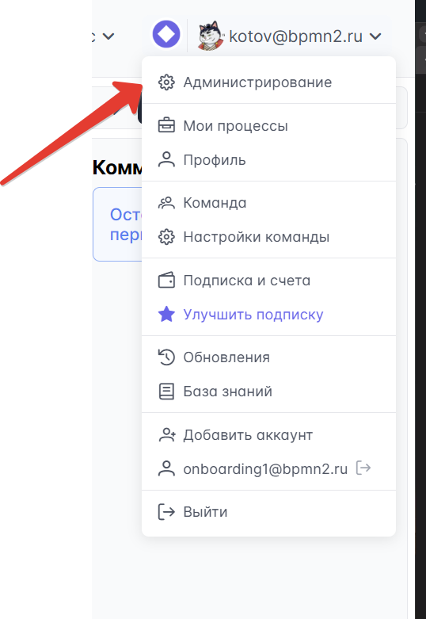

# Быстрый старт

Для минимальной работы приложения вам потребуется всего **2 контейнера**:

-   Контейнер приложения
-   База данных

## Настройка базы данных

1. **Разверните PostgreSQL** (версия 12 или новее):

    - Используйте Docker контейнер
    - Или подключитесь к существующей инфраструктуре компании

2. **Создайте схему** (опционально):

    - По умолчанию используется схема `public`
    - Сохраните название схемы для дальнейшей настройки

3. **Создайте базу данных**:

    - Выберите подходящее название
    - Сохраните название базы

4. **Создайте пользователя**:

    - Предоставьте полные права доступа к базе и схеме
    - Сохраните логин и пароль

5. **Определите порт**:

    - Узнайте порт сервера БД (обычно 5432)
    - Сохраните значение для подключения

6. **Обеспечьте сетевую доступность**:
    - Настройте соединение между базой данных и контейнером приложения

## Настройка приложения через переменные окружения

### Получение образа

Скачайте образ приложения из репозитория (запросите ссылку и параметры авторизации у нашей команды).

### Настройка ENV переменных

| Переменная                 | Описание                         | Пример значения                            |
| -------------------------- | -------------------------------- | ------------------------------------------ |
| **JDBC_URL**               | Строка подключения к базе данных | `jdbc:postgresql://192.168.0.6:5432/storm` |
| **JDBC_USERNAME**          | Имя пользователя базы данных     | `stormuser`                                |
| **JDBC_PASSWORD**          | Пароль пользователя              | `your_secure_password`                     |
| **JAVA_OPTS**              | Настройки памяти для JVM         | `"-Xmx8g"`                                 |
| **SPRING_PROFILES_ACTIVE** | Профиль Spring Boot              | `prod`                                     |
| **JWTSECRET**              | Соль для шифрования паролей      | Не менее 15 случайных символов             |
| **TZ**              | Таймзона контейнера      |`Europe/Moscow`           |

> **Примечание по JDBC_URL:**
>
> Для подключения к определенной схеме используйте:
> `jdbc:postgresql://localhost:5432/mydatabase?currentSchema=myschema`

### Запуск контейнера

1. Запустите контейнер с настроенными переменными окружения
2. При успешном запуске миграции базы данных выполнятся автоматически
3. Настройте порт для доступа к приложению (контейнер использует порт 8081)

::: tip Поздравляем!
Минимальная установка готова! Теперь вы можете получить доступ к приложению через веб-интерфейс по настроенному порту.
:::

## Получение лицензионного ключа

Для продолжения настройки необходим лицензионный ключ:

1. **Создайте HAR-архив**:
    - Откройте браузер и перейдите в приложение по IP
    - Создайте HAR-архив из инструментов разработчика от момента загрузки страницы
2. **Отправьте архив менеджеру**:

    - Пришлите HAR-архив нашему менеджеру
    - Получите лицензионный ключ в ответном письме

3. **Добавьте ключ в переменные окружения**:
    - **LICENSE_KEY** - ваш лицензионный ключ

## Создание административной учетной записи

### Пошаговая инструкция:

1. **Первоначальная регистрация**:

    - Откройте приложение в браузере
    - Зарегистрируйтесь с логином и паролем
    - Выполните вход в систему

2. **Создание команды**:

    - Перейдите по ссылке: `/app/team/participants`
    - Создайте новую команду

3. **Активация административных прав**:

    - Выполните в базе данных следующий запрос:

    ```sql
    UPDATE sm_teams SET full_access = true;
    ```

4. **Завершение настройки**:
    - Перезайдите в систему для применения изменений
    - Теперь у вас есть доступ к административному интерфейсу
    - Все последующие участники этой команды также получат административные права

> **Важно:** Не используйте эту учетную запись для повседневной работы!



## Настройка авторизации

Для настройки системы входа в приложение ознакомьтесь с [подробной инструкцией по обеспечению информационной безопасности](/enterprise/security.md) и выберите подходящий вариант для вашей организации.

---

## Важно: Следующие шаги

::: danger Эта установка только для тестирования!
**Внимание!** Описанная выше минимальная установка предназначена **исключительно для проверки работоспособности** и знакомства с системой.

**НЕ используйте эту конфигурацию для работы с реальными пользователями!**

### Почему эта установка не подходит для продакшена:

-   **Отсутствует SSL/HTTPS** - данные передаются в открытом виде
-   **База данных не защищена** - нет резервного копирования и отказоустойчивости
-   **Нет мониторинга** - невозможно отследить проблемы и производительность
-   **Упрощенная авторизация** - нет интеграции с корпоративными системами
-   **Нет уведомлений** - пользователи не получат письма о процессах
-   **Нет хранилища файлов** - ограниченные возможности работы с документами

### Что произойдет, если не настроить production-ready:

-   **Пользователи будут недовольны** медленной работой и ошибками
-   **Потеря данных** при сбоях системы
-   **Проблемы с безопасностью** и утечка конфиденциальной информации
-   **Невозможность масштабирования** при росте количества пользователей
    :::

### Следующие шаги для продакшена:

1. **[Production Ready](/install/PRODUCTION.md)** - настройка для промышленной эксплуатации
2. **[Безопасность](/enterprise/security.md)** - настройка HTTPS, авторизации и аудита
3. **[Мониторинг](/install/MONITORING.md)** - контроль производительности и доступности
4. **[Резервное копирование](/install/BACKUP.md)** - защита от потери данных

> **Совет:** Планируйте переход на production-ready конфигурацию **до** подключения реальных пользователей. Миграция работающей системы значительно сложнее первоначальной настройки.
