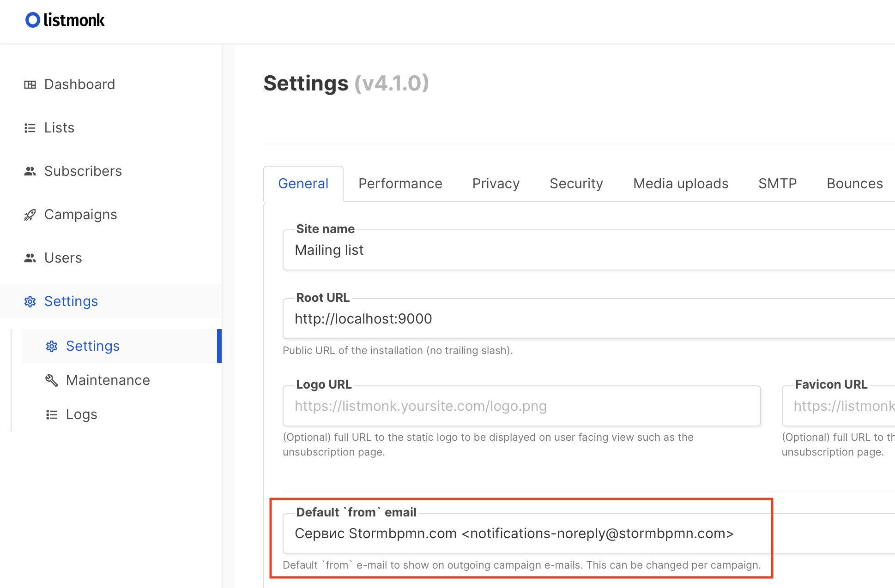
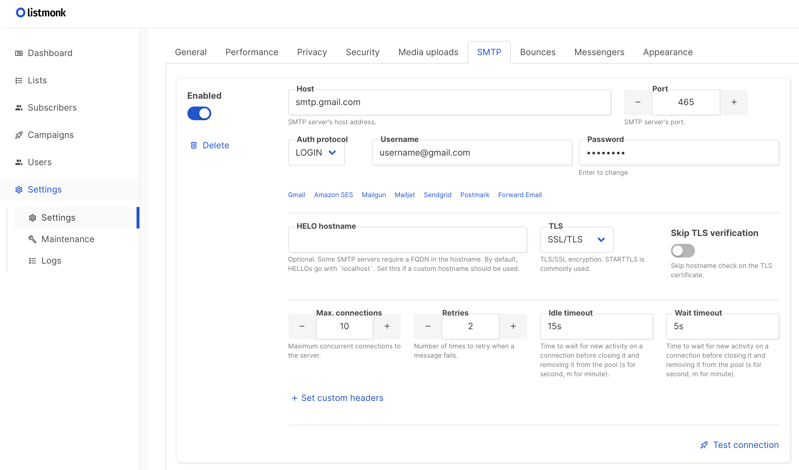
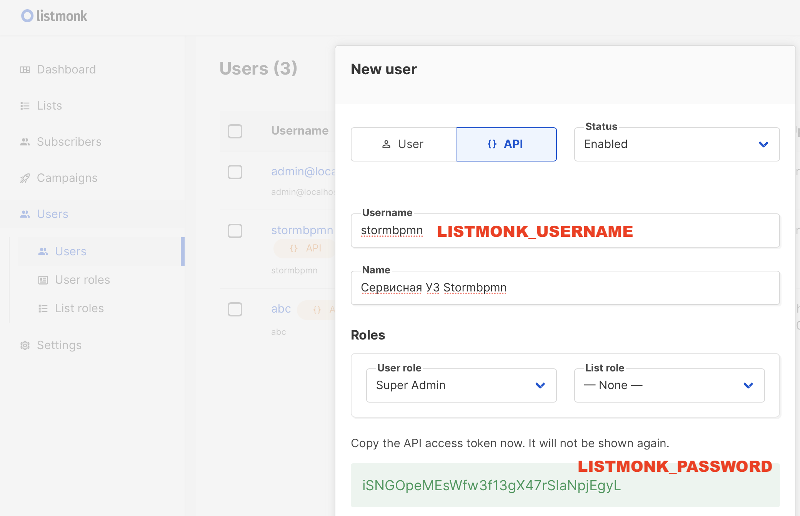
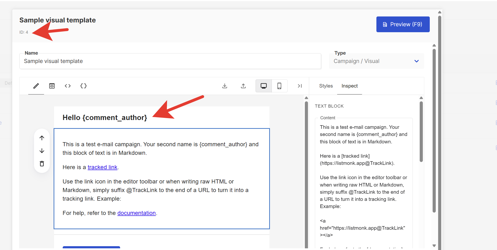
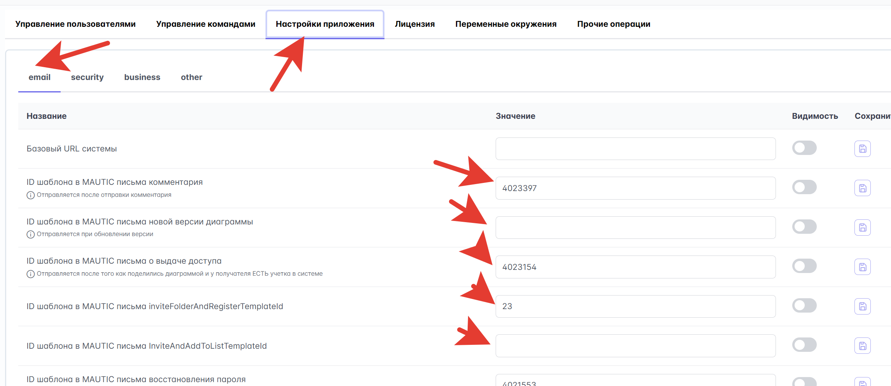

[[toc]]

# Внешние сервисы

Развёртывание сервисов, от которых зависит StormBPMN: объектное хранилище, Redis, PlantUML, конвертация
документов и почта. Базовый чек-лист и балансировщик — в [обзоре Production-установки](./README.md).

## S3-хранилище для файлов

### Что хранится в S3:

-   **Изображения бизнес-процессов** - схемы и диаграммы
-   **Аватары пользователей** - профильные изображения
-   **Шаблоны документов** - для генерации отчетов
-   **Вложения** - файлы, прикрепленные к процессам

::: tip Что выбрать, если нет корпоративного S3
StormBPMN работает с любым S3-совместимым хранилищем. Два простых варианта для self-host:

- **MinIO** — привычный вариант (см. ниже). Учтите: в свежих релизах community-консоль MinIO урезали до простого браузера объектов — управление бакетами/политиками из веб-интерфейса убрали.
- **[SeaweedFS](#альтернатива-seaweedfs-простое-s3-со-встроенным-ui)** — лёгкое S3-хранилище одним контейнером со **встроенным веб-интерфейсом** (Filer). Рекомендуем, если нужен простой UI и минимум возни.
:::

### Рекомендуемое решение: MinIO

:::info
Если вы пользовались [скриптом](/install/quickstart/QUICKSTART_SCRIPT.md) для быстрого старта,
то MinIO уже успешно развернут и подключен к системе.
:::

#### Установка MinIO

```bash
# Запуск MinIO в Docker
docker run -d \
  -p 9000:9000 \
  -p 9001:9001 \
  --name minio \
  -v /mnt/data:/data \
  -e "MINIO_ROOT_USER=stormbpmn-s3-user" \
  -e "MINIO_ROOT_PASSWORD=stormbpmn-s3-password" \
  quay.io/minio/minio server /data --console-address ":9001"
```

#### Создание дефолтного бакета

```bash
curl -fO https://dl.min.io/client/mc/release/linux-amd64/mc
chmod +x mc
mv mc /usr/local/bin/
mc alias set minio http://localhost:9000 "stormbpmn-s3-user" "stormbpmn-s3-password"
mc mb minio/storm-uploads
```

#### Настройка переменных окружения

| Переменная                 | Описание                               | Пример значения           |
|----------------------------|----------------------------------------|---------------------------|
| **S3_ENDPOINT**            | URL хранилища                          | `http://192.168.0.4:9000` |
| **S3_ACCESS_KEY**          | Ключ доступа                           | `stormbpmn-s3-user`       |
| **S3_SECRET_KEY**          | Секретный ключ                         | `stormbpmn-s3-password`   |
| **S3_BUCKET_UPLOADS**      | Бакет по умолчанию                     | `storm-uploads`           |
| **S3_BUCKET_USERS**        | Бакет для пользователей                | `storm-users`             |
| **S3_BUCKET_IMPORTS**      | Бакет для импортов                     | `storm-imports`           |
| **S3_SINGLE_USERS_BUCKET** | Режим единого бакета для пользователей | `true`                    |

При использовании другого S3-хранилища, совместимого с AWS SDK v2, может также понадобиться:
- Установить переменную `S3_REGION`, соответствующую конфигурации вашего хранилища
- Установить переменную `S3_VIRTUAL_HOST=true` для vHosted типа адресации (по умолчанию `false` для Path-Style)

:::info Единый пользовательский бакет
- Для свежей установки рекомендуем использовать `S3_SINGLE_USERS_BUCKET=true`.
- Если у вас уже установлен Storm и подключен к S3-хранилищу, в котором каждый пользователь имеет свой бакет (вида `user123`),
вы можете смигрировать их в единый бакет (например, `storm-users`), указать его в переменной `S3_BUCKET_USERS`
и переключить режим работы на `S3_SINGLE_USERS_BUCKET=true`. В таком случае путь до пользовательских файлов будет
выглядеть как `s3://storm-users/user123/...`
:::

#### Проверка работоспособности

После настройки при сохранении диаграмм должны отображаться их миниатюры в карточном представлении.

::: tip Документация MinIO
Полное руководство по установке: [MinIO Documentation](https://min.io/docs/minio/linux/index.html)
:::

### Альтернатива: SeaweedFS (простое S3 со встроенным UI)

[SeaweedFS](https://github.com/seaweedfs/seaweedfs) — лёгкое S3-совместимое хранилище. Запускается **одним контейнером**, имеет встроенный веб-интерфейс (Filer) и совместимо с адресацией path-style, которую использует StormBPMN. Хороший выбор, если корпоративного S3 нет, а MinIO не устраивает.

#### Шаг 1. Учётные данные доступа

S3 в SeaweedFS по умолчанию открыт без пароля — обязательно задайте ключи доступа через конфиг. Создайте файл `s3-config.json`:

```json
{
  "identities": [
    {
      "name": "stormbpmn",
      "credentials": [
        { "accessKey": "stormbpmn-s3-user", "secretKey": "stormbpmn-s3-password" }
      ],
      "actions": ["Admin", "Read", "Write", "List", "Tagging"]
    }
  ]
}
```

#### Шаг 2. Запуск контейнера

```bash
docker run -d \
  --name seaweedfs \
  --restart unless-stopped \
  -p 8333:8333 \
  -p 8888:8888 \
  -v /mnt/seaweedfs:/data \
  -v "$(pwd)/s3-config.json:/etc/seaweedfs/s3-config.json:ro" \
  chrislusf/seaweedfs server \
    -dir=/data \
    -s3 \
    -s3.port=8333 \
    -s3.config=/etc/seaweedfs/s3-config.json
```

Команда `server` поднимает master, volume, filer и S3-шлюз в одном процессе.

| Порт     | Назначение                                  |
| -------- | ------------------------------------------- |
| **8333** | S3 API (его указываем в `S3_ENDPOINT`)      |
| **8888** | Filer — веб-интерфейс для просмотра файлов  |

#### Шаг 3. Создание бакета

```bash
docker exec -i seaweedfs weed shell <<< "s3.bucket.create -name storm-uploads"
```

Либо любым S3-клиентом с теми же ключами (например, AWS CLI):

```bash
aws --endpoint-url http://localhost:8333 s3 mb s3://storm-uploads
```

#### Шаг 4. Переменные окружения StormBPMN

```bash
S3_ENDPOINT=http://<хост-seaweedfs>:8333
S3_ACCESS_KEY=stormbpmn-s3-user
S3_SECRET_KEY=stormbpmn-s3-password
S3_BUCKET_UPLOADS=storm-uploads
S3_SINGLE_USERS_BUCKET=true
# Адресация path-style включена по умолчанию (S3_VIRTUAL_HOST=false) — менять не нужно.
```

#### Шаг 5. Проверка

- Откройте веб-интерфейс Filer: `http://<хост-seaweedfs>:8888` — там видны бакеты и файлы.
- В StormBPMN сохраните диаграмму — в карточном представлении должна появиться её миниатюра, а в бакете `storm-uploads` (в Filer) — соответствующий объект.

::: tip Документация SeaweedFS
S3 API и его настройка: [SeaweedFS — Amazon S3 API](https://github.com/seaweedfs/seaweedfs/wiki/Amazon-S3-API).
:::

---

---

## Redis: совместное редактирование диаграмм

Redis используется для функции **совместного редактирования диаграмм** в реальном времени. Он обеспечивает:

-   **Pub/Sub** - доставка сообщений между экземплярами приложения (курсоры, изменения XML, присутствие)
-   **Хранение сессий** - информация о текущих участниках совместного редактирования

::: tip Когда нужен Redis?
-   **Один экземпляр StormBPMN** — Redis **не требуется**. Данные хранятся в памяти приложения (InMemory-режим)
-   **Несколько экземпляров** (multi-instance / HA) — Redis **обязателен** для синхронизации между нодами
:::

### Установка

```bash
# Запуск Redis в Docker
docker run -d \
  -p 6379:6379 \
  --name redis \
  redis:7-alpine
```

Для production рекомендуется задать пароль:

```bash
docker run -d \
  -p 6379:6379 \
  --name redis \
  redis:7-alpine \
  redis-server --requirepass your-secure-password
```

### Настройка переменных окружения

| Переменная            | Описание                | Пример значения    | Обязательно                |
| --------------------- | ----------------------- | ------------------ | -------------------------- |
| **REDIS_ENABLED**     | Включение Redis         | `true`             | Для multi-instance         |
| **REDIS_HOST**        | Хост Redis              | `192.168.0.7`      | При REDIS_ENABLED=true     |
| **REDIS_PORT**        | Порт Redis              | `6379`             | При REDIS_ENABLED=true     |
| **REDIS_PASSWORD**    | Пароль Redis            | `your-password`    | Если задан на сервере      |
| **REDIS_DATABASE**    | Номер базы данных Redis | `0`                | Опционально (по умолч. 0)  |
| **REDIS_TIMEOUT**     | Таймаут подключения     | `1000ms`           | Опционально                |

### Проверка работоспособности

После настройки откройте одну диаграмму в двух вкладках браузера — вы должны видеть аватары других участников на холсте и синхронизацию изменений в реальном времени.

### Настройка балансировщика для WebSocket

Совместное редактирование использует **WebSocket** (STOMP over SockJS) через путь `/ws`. Убедитесь, что балансировщик проксирует WebSocket-соединения. Пример конфигурации приведен в [разделе выше](#конфигурация-nginx).

::: warning Sticky Sessions
При использовании нескольких нод за балансировщиком WebSocket-соединения должны поддерживать **sticky sessions** (привязку к ноде) — иначе SockJS fallback может не работать корректно.
:::

---

---

## PlantUML сервер (опционально)

Обеспечивает генерацию UML-диаграмм в интерфейсе приложения.

:::info
Если вы пользовались [скриптом](/install/quickstart/QUICKSTART_SCRIPT.md) для быстрого старта,
то PlantUML уже успешно развернут и подключен к системе.
:::

### Установка

```bash
# Запуск PlantUML сервера
docker run -d \
  -p 8090:8080 \
  --name plantuml \
  plantuml/plantuml-server:jetty
```

### Настройка

| Переменная          | Описание             | Пример значения            |
| ------------------- | -------------------- | -------------------------- |
| **PLANTUML_SERVER** | URL сервера PlantUML | `http://192.168.0.5:8090/` |

---

---

## Сервис конвертации документов

Обеспечивает конвертацию HTML в PDF и другие форматы документов.

:::info
Если вы пользовались [скриптом](/install/quickstart/QUICKSTART_SCRIPT.md) для быстрого старта,
то Gotenberg уже успешно развернут и подключен к системе.
:::

### Установка Gotenberg

```bash
# Запуск Gotenberg
docker run -d \
  -p 3001:3000 \
  --name gotenberg \
  gotenberg/gotenberg:8
```

::: tip Можно использовать наш образ Gotenberg
Если в организации запрещены внешние реестры (Docker Hub), используйте зеркало Gotenberg в нашем приватном реестре — это официальный образ `gotenberg/gotenberg:8`, **подписанный той же подписью Cosign**, что и основной образ StormBPMN, и доступный по **тем же** учётным данным `cr.selcloud.ru`:

```bash
docker run -d \
  -p 3001:3000 \
  --name gotenberg \
  cr.selcloud.ru/stormbpmn-enterprise/gotenberg:8
```

Подпись проверяется так же, как у основного образа (см. [Changelog → «Проверка подписи образа (Cosign)»](/Changelog/README.md)). Перенос образа в корпоративный реестр — по инструкции из [Быстрого старта](/install/quickstart/QUICKSTART_MANUAL.md).
:::

### Настройка

| Переменная        | Описание                | Пример значения           |
| ----------------- | ----------------------- | ------------------------- |
| **GOTENBERG_URL** | URL сервиса конвертации | `http://192.168.0.5:3001` |

#### Дополнительная настройка для сложных сетевых конфигураций

Если используются балансировщики или сложная SSL конфигурация, может потребоваться указать прямой адрес контейнера:

**В административном интерфейсе:**

-   **gotenbergOverrideBaseUrl** - прямой адрес: `http://corp.storm.internal`

---

---

## Настройка почтовых уведомлений

### Выбор провайдера почты

| Вариант          | Когда использовать                                 | Сложность настройки |
| ---------------- | -------------------------------------------------- | ------------------- |
| **ListMonk**     | Нужны красивые письма, есть ресурсы на их создание | ⭐⭐⭐              |
| **Простой SMTP** | Нужна базовая функциональность                     | ⭐                  |

Обязательно укажите это значение в административной панели, чтобы в письмах формировались правильные URL. Эту настройку необхожимо указать для любых провайдеров:

| Параметр    | Описание                         | Пример                          |
| ----------- | -------------------------------- | ------------------------------- |
| **baseUrl** | Базовый URL для ссылок в письмах | `https://stormbpmn.company.com` |

### Вариант 1: ListMonk (красивые письма)

#### Установка ListMonk

```bash
# Скачивание конфигурации
 curl -LO https://github.com/knadh/listmonk/raw/master/docker-compose.yml

# Запуск (при необходимости измените порты в docker-compose.yml)
docker compose up -d
```

#### Настройка ListMonk

1. **Откройте панель администратора**: `http://localhost:9000`
2. **Создайте супер-пользователя** и войдите в систему
3. **Настройте общие параметры** (Settings → General):

    - Укажите email по умолчанию для отправки

    

4. **Настройте SMTP** (Settings → SMTP):

    - Указать параметры корпоративного SMTP сервера
    - Протестировать соединение

    

5. **Создайте API пользователя**:

    - Users → New → Тип: API
    - Роль: Super Admin
    - Сохраните API токен

    

#### Переменные окружения для StormBPMN

```bash
EMAIL_PROVIDER=listmonk
LISTMONK_BASE_URL=http://localhost:9000/api
LISTMONK_USERNAME=stormbpmn  # имя API пользователя
LISTMONK_PASSWORD=api-token-here  # API токен
```

#### Шаблоны писем

Создайте шаблоны писем в listmonk по данным темам и зафиксируйте ID каждого шаблона в админке Stormbpmn.

::: warning Синтаксис подстановок
Listmonk использует синтаксис Go-шаблонов: переменные доступны через `{{ .Tx.Data.имя }}`, а не `{имя}`. Например, `{{ .Tx.Data.diagram_name }}`.
:::



| Тип уведомления                         | Настройка в админке                  | Возможные подстановки                                                                                                       |
| --------------------------------------- | ------------------------------------ | --------------------------------------------------------------------------------------------------------------------------- |
| **Новый комментарий**                   | `commentEmailTemplateId`             | `{{ .Tx.Data.comment_author }}`, `{{ .Tx.Data.diagram_name }}`, `{{ .Tx.Data.diagram_url }}`, `{{ .Tx.Data.html_text }}`     |
| **Запрос на согласование**              | `approvalTemplateId`                 | `{{ .Tx.Data.invite_author }}`, `{{ .Tx.Data.diagram_name }}`, `{{ .Tx.Data.diagram_url }}`                                 |
| **Восстановление пароля**               | `restorePasswordTemplateId`          | `{{ .Tx.Data.restoreCode }}`                                                                                                |
| **Согласование завершено**              | `approvalCompletedTemplateId`        | `{{ .Tx.Data.diagram_name }}`, `{{ .Tx.Data.diagram_url }}`                                                                 |
| **Активация пользователя**              | `userActivationTemplateId`           | `{{ .Tx.Data.activation_token }}`                                                                                           |
| **Приглашение к диаграмме**             | `secureUpdateTemlateId`              | `{{ .Tx.Data.invite_author }}`, `{{ .Tx.Data.diagram_name }}`, `{{ .Tx.Data.diagram_url }}`                                 |
| **Приглашение + регистрация**           | `inviteDiagramAndRegisterTemplateId` | `{{ .Tx.Data.invite_author }}`, `{{ .Tx.Data.diagram_name }}`, `{{ .Tx.Data.diagram_url }}`, `{{ .Tx.Data.register_url }}`   |
| **Приглашение в команду**               | `teamInviteTemplateId`               | `{{ .Tx.Data.invite_author }}`, `{{ .Tx.Data.team_name }}`                                                                  |
| **Приглашение в команду + регистрация** | `teamInviteAndRegisterTemplateId`    | `{{ .Tx.Data.invite_author }}`, `{{ .Tx.Data.team_name }}`, `{{ .Tx.Data.register_url }}`                                   |
| **Запрос доступа к диаграмме**          | `accessRequestTemplateId`            | `{{ .Tx.Data.requester_name }}`, `{{ .Tx.Data.diagram_name }}`, `{{ .Tx.Data.diagram_url }}`, `{{ .Tx.Data.request_message }}` |

::: tip Опечатка в ключе
Ключ `secureUpdateTemlateId` указан **с опечаткой намеренно** — именно так он называется в настройках системы (без `p` в `Temlate`).
:::

#### Укажите ID шаблон в адмнике Stormbpmn



### Вариант 2: Простой SMTP

#### Переменные окружения

| Параметр           | Описание                                                  | Пример                  |
| ------------------ | --------------------------------------------------------- | ----------------------- |
| **EMAIL_PROVIDER** | Включить простой SMTP                                     | `smtp`                  |
| **SMTP_HOST**      | SMTP хост                                                 | `smtp.company.com`      |
| **SMTP_PORT**      | SMTP порт                                                 | `587`                   |
| **SMTP_USERNAME**  | SMTP пользователь                                         | `stormbpmn@company.com` |
| **SMTP_PASSWORD**  | SMTP пароль                                               | `secure-password`       |
| **SMTP_FROM**      | Email отправителя                                         | `stormbpmn@company.com` |
| **SMTP_PROTOCOL**  | SMTP/STARTTLS/SMTPS. STARTTLS - по-умолчанию              | `STARTTLS`              |
| **SMTP_USE_AUTH**  | true/false. Использовать авторизацию. true - по-умолчанию | `true`                  |

#### Переменные окружения

```bash
EMAIL_PROVIDER=smtp
SMTP_PROTOCOL=
SMTP_HOST=
SMTP_PORT=
SMTP_USERNAME=
SMTP_PASSWORD=
SMTP_FROM=
SMTP_USE_AUTH=

```

::: tip Требуется перезагрузка
Все настройки SMTP применяются **только после перезагрузки** приложения.
:::

### Тестирование почтовых уведомлений

Для проверки отправки писем оставьте комментарий с содержимым:

```
@your.email@company.com test
```

---
