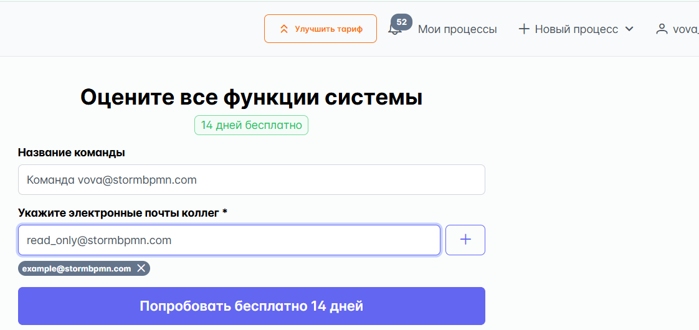
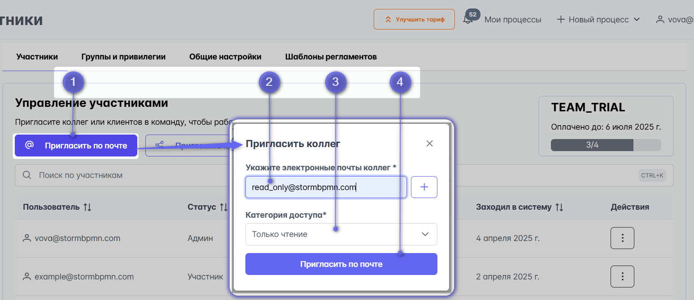
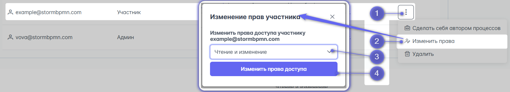
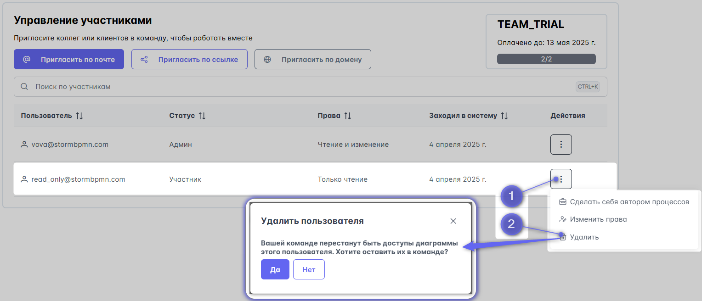
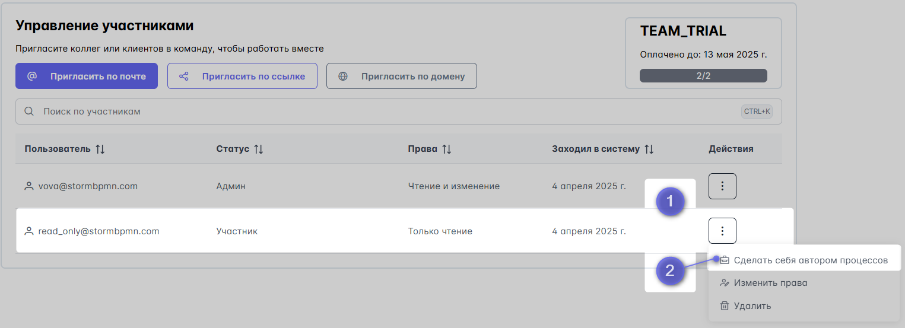

---
dir:
  order: 4
  link: true
  text: Работа в команде и расширенные функции
  collapsible: false
index: true
icon: "user-group"
---

# Командная работа
:::danger
Раздел в разработке. Одновременная работа с одной диаграммой из нескольких вкладок или браузеров пока не поддерживается.
:::

Командная работа в система в работе предназначена для того, чтобы экономить ваше время за счет:
- Все видят одни и теже процессы
- Все процессы в актуальном состоянии
- Не надо пересылать файлы и ссылки
- Все изменения версионируются и можно откатиться к пред. версиям, если кто-то что-то сломал
- Можно посмотреть, чем текущая версия отличается от предыдущей.

## 4 типа командной работы
В системе существует несколько способов поделиться своей работой с коллегами:
1) на уровне процесса;
2) на уровне команды;
3) на уровне предприятия.  

 Чем ближе выданы права к диаграмме, тем они сильнее. Т.е. права на уровне процесса сильнее прав на уровне папки. А на уровне папки - сильнее чем на уровне команды.

### На уровне процесса - поделиться конкретной диаграммой 

Это способ работает когда нужно просто поделиться одной диаграммой. Он описан в функции [Поделиться диаграммой](/features_new_storm/1_bpmn-editor/#поделиться-диаграммои)

::: tip
Этот вариант хорошо работает, когда вы не хотите приглашать человека в вашу команду, но вам нужно поделиться с ним группой каких-то процессов.
::: 

## Управление командой
Команда - это группа людей, которые вместе работают над одними процессами. _Например, у вас есть команда "Кредитные карты", в которой 10 человек и все они работают с продуктом "Кредитная карта"_.  
Участники команды, в отличии от всех других способов совместной работы, получают такие приемущества:
1) **Видят все диаграммы всех участников команды автоматически**, без необходимости предоставлять права
2) Видят структуру папок 
3) Работают по общим требованиям, правилам качества описания процессов
4) У них общие:
   - [оргструктура](../team-work/3_org-chart-editor.html)
   - [роли](../team-work/4_assignees.html)
   - [элементы архитектуры](../team-work/5_elements-architecture/)  
   - [шаблоны регламентов](../team-work/6_reglaments/process_reglament.html#шаблон-регламента-процесса)  

::: danger
Доступность диаграмм для членов команды определяется по ее участникам. Участник входит в команду - его диаграммы всем видны. Участник уволился и его убрали из команды - диаграммы не видны.  
Чтобы **избежать недоступности диаграмм после увольнения сотрудников** используйте кнопку ["Сделать себя автором процессов"](#сделать-себя-автором-процессов)  перед тем, как удалить участника.
:::

### Cоздание команды
Создать команду может любой пользователь системы по [ссылке](https://stormbpmn.com/app/team/participants)  

::: tip
Создание команды в первый раз включает **бесплатный** тестовый период для ознакомления со всеми функциями системы. Попробуйте!
:::

### Приглашение в команду
Чтобы команда работала, люди должны иметь учетные записи в системе и вступить в команду. Есть несколько способов вступить в команду:
#### По почте
При создании команды или по [ссылке](https://stormbpmn.com/app/team/participants) при нажатии на кнопку __"пригласить по почте"__ вы можете указать почтовые ящики ващих коллег. Если у них есть аккаунт в системе и они не входят в команды, от они сразу же будут добавлены в вашу команду. Если у них нет аккаунтов, то сначала они получат приглашение зарегистрироваться.

::: danger 
Поскольку приглашение по почте связано с отправкой писем от нашего имени, у нас встроена защита от спама. Не отправляйте больше 5 приглашений за раз.
::: 

#### По ссылке
Самый удобный вариант - получить ссылку по кнопке __"Пригласить по ссылке"__ и отправить его коллегам удобным Вам способом. Перейдя по ней они смогут зарегистрироваться или присоедениться к команде. В этом случае у них будут права на чтение, их можно будет сменить позднее.  

#### По домену
Если ваша организация имеет свой домен, например __stormbpmn.com__  , то вы можете указать его в настройках команды. Тогдай любой человек с такой почтой, например __d.kotov@stormbpmn.com__, получат возможность вступить в вашу команду.  Тоже хороший способ собрать всех коллег вместе. Указываете домен и говорите "Регистрируемся с рабочих почт и вступаем в команду!".

### Управление правами
В системе у участников команды есть базовые права 3 типов:
1) __Админ__ - права управления командой и её объектами: пр роли, элементы архитектуры (создание, редактирование, удаление).
2) __Чтение и изменение__ - НЕ может создавать роли и элементы архитектуры, НЕ может менять настройки команды. Может редактировать папки и диаграммы коллег.
3) __Только чтение__ - Не может редактировать диаграммы коллег, не может трогать папки. Может создавать диаграммы.

Управление правами осуществяется путем выбора участника из списка команды и нажатия на кнопку **"Изменить права"**.\

### Гранулярные права
:::danger В разработке
Функция гранулярных прав позволяет выдавать участникам команды индивидуальные наборы прав к каждому типу объектов системы: папки, роли, элементы архитектуры, оргструктура, реестр процессов и т.д.
:::

### Удаление участника из команды
Админ команды имеет возможность удалить участника из команды.
При удалении система выдаст предупреждение о риске недоступности диаграмм удаляемого участника. И предложить оставить их в команде

Если желаете оставить в команде диаграммы удаляемого участника, то используйте кнопку
### Сделать себя автором процессов

### Прочие настройки команды
### Выход из команды
### Удаление команды

## Поделиться процессом
## Встроить процесс
## Поделиться папкой
## Гости
